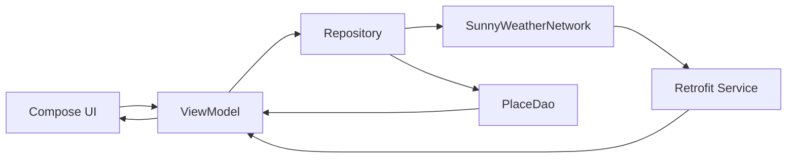

# 架构设计

## 总览
项目采用分层架构：
- `ui`：Compose 页面与交互。
- `logic`：仓库层、网络层、本地缓存层。
- `model`：接口响应模型和展示模型。

## 分层职责
### UI 层（`ui/place`, `ui/weather`）
- 页面渲染：`PlaceSearchScreen`、`WeatherScreen`。
- 状态管理：`PlaceViewModel`、`WeatherViewModel`。
- 一次性事件：通过 `SharedFlow<String>` 向 UI 发出 Toast 消息。

### 仓库层（`logic/Repository.kt`）
- 提供统一的数据访问入口。
- 聚合网络请求与本地缓存接口，减少 UI 对实现细节的感知。

### 数据层
- 网络：`SunnyWeatherNetwork` + Retrofit Service。
- 本地：`PlaceDao` 使用 SharedPreferences + Gson 缓存地点。

## 关键数据流

## 页面交互流
### 启动流程
1. 启动 `MainActivity`。
2. 若本地有有效地点缓存，直接跳转 `WeatherActivity`。
3. 否则展示地点搜索页面。

### 地点搜索流程
1. 输入关键词触发 `onQueryChanged()`。
2. ViewModel 异步请求地点接口。
3. 成功后更新地点列表；失败时发出 Toast 事件。
4. 点击地点后保存缓存并跳转/刷新天气页面。

### 天气刷新流程
1. 进入天气页会自动刷新一次。
2. 下拉刷新或切换地点都会调用 `refreshWeather()`。
3. `daily` 与 `realtime` 并发请求，成功后合并为 `Weather`。
4. 使用请求序号丢弃过期响应，避免旧请求覆盖新地点结果。

## 稳定性与防护
- 过期请求保护：`refreshRequestId` / `searchRequestId`。
- 协程取消语义：`CancellationException` 不被吞掉。
- 缓存容错：坏数据反序列化失败时返回 `null` 并可清理。
